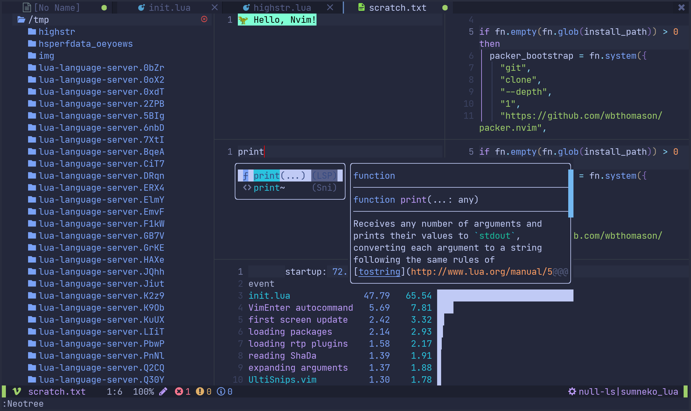
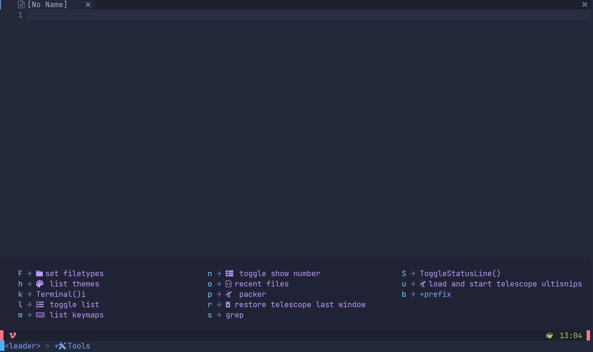

<div align="center">
  <hr>
  <h2>🍃 Neovim</h2>
  <p> 💡 A personal neovim configuration</p>
	🏠 <a href="https://oeyoews.github.io/nvim">Home</a>&nbsp;
  🔗 <a href="">Links </a>&nbsp;
  ⬇️  <a  href="">Download</a>&nbsp;
  🔰 <a  href="">More</a>&nbsp;
  <hr>
</div>

<div align="center">
<!--  -->


<!--  -->


<!--  -->


<!--  -->
<!--  -->

</div>
<hr>

# Toc

<!-- vim-markdown-toc Marked -->

* [ShowCases](#showcases)
* [What's that](#what's-that)
* [Install](#install)
* [Features](#features)
* [TODO](#todo)
* [Links](#links)

<!-- vim-markdown-toc -->

## ShowCases

|        |  |
|:-------------------------------------------------------:|:-------------------------------------------------------:|
|  |                           etc                           |

## What's that

💡 A personal neovim configuration

## Install

- install pynvim and clone this repository

```bash
git clone --depth 1 https://gitlab.com/oeyoews/nvim.git ~/.config/nvim  # please your ~/.config/nvim folder or your nvim configuration
```

## Features

* switch day-night nvim theme base time automatically
* module manage nvim config, use pure lua
* builtin plugins, like tokynight, notify and some telescope extensions .
* install lsp-servers base your current development automatically
* faster nvim startup, about (60~70) ms
* support markdown-preview and past image in neovim
* support ranger
* hide tilde and show time in statusline
* customize shortkeys
* support codespell
* hide cursorline in insert mode
* customize snippets with ultisnips
* backup plugin snapshot with packer
* etc

## TODO

<details>
<summary>🚀</summary>

- [ ] inlay hints
- [ ] learn vim.api(nvim), such use  vim.fn.executable to replace os.executable
- [ ] link null-ls make a logger file
- [ ] theme: https://github.com/nshen/learn-neovim-lua/blob/main/lua/utils/change-colorscheme.lua
- [ ] tiny all which-key mappings
- [ ] control module to install or uninstall plugins
- [ ] use packer make packersnapshot
- [ ] emulate key pressing
- [x] cursor shake for null-ls
- [x] vim-plug or packer.nvim index probleb
- [x] config setting conflict
- [x] integrate husky and (prettier)
- [x] highlight paraness
- [x] learn lightspeed
- [x] learn use visual-line multi curline
- [?] json add double how effect config
- [x] add format stylua by ci/cd
- [x] insert mode to hide cursorline
- [x] automatically install filetype server when first open
- [?] bug: treesitter multi download
- [x] config opt(load)
- [x] learn packer, test packer automatically
- [x] format lua(include vim), this treesitter
- [x] learn lua: doom-nvim, nvchad to deeply look
- [x] add highlight symbols under cursor functions(terminal gnome support)
- [x] use packer.nvim to replace vim-plug
- [x] tidy vanilla.txt, maybe can write vanilla.markdown, last to txt
- [x] config tab space show in different filetype
- [x] move plugins/\*.lua to lua folder, and to pure lua config
- [x] add window number switch number(mousenum)
- [x] solve gitsign utf8
- [x] how to add templates in nvim
- [x] config norg table
- [x] config format
- [x] some sitution will cause error line repeat(maybe emoji or refresh time error)
- [x] snowflake: this emoji will cause this bug in kitty(only)
- [x] config new theme for material, like tilde,
- [x] add shortkeys in vim to open browser html
- [?] fix the zh bug(maybe also is terminal)
- [x] add random banner and random color startup <https://github.com/goolord/alpha-nvim/discussions/16#discussioncomment-2386902>
- [x] first install automatically install
- [x] config dashboard
- [x] this emjoi shadow bug, maybe is kitty terminal(switch to wezterm compare)
- [x] some error tip from feline(active)
- [x] learn it option setting and lsp multi separate setting: fix lua global vim setting, <https://github.com/AstroNvim/AstroNvim>,

</details>

## Links

* [neovim form](https://neovim.discourse.group)
* [emmylua comment](https://emmylua.github.io/zh_CN/annotation.html)
* [neovimcraft](https://neovimcraft.com/)
