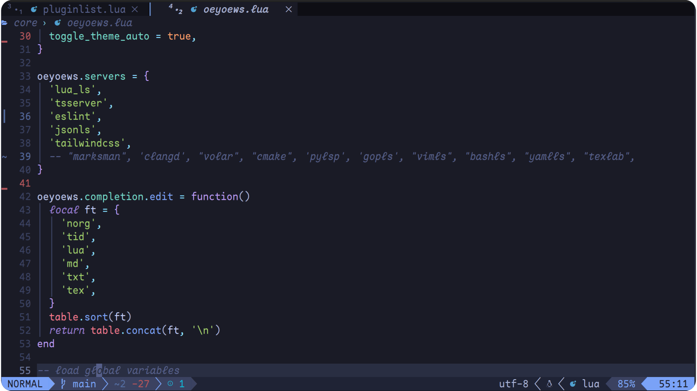

## NOTE

* node, npm, git, python-pynvim

> ts, js, tailwindcss, lua, json, eslint 开箱即用

## 🔗 Neovim Related Snippets Links

> ultisnips2vscode
- [convertsnippet snippet to json](https://pypi.org/project/ultisnips-vscode/)

- [convert](https://github.com/VincentCordobes/convert-snippets/)
- [neovimcraft](https://neovimcraft.com/)
- [awesome](https://github.com/rockerBOO/awesome-neovim)
