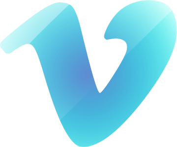
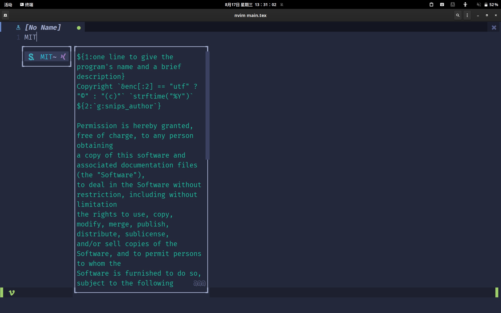
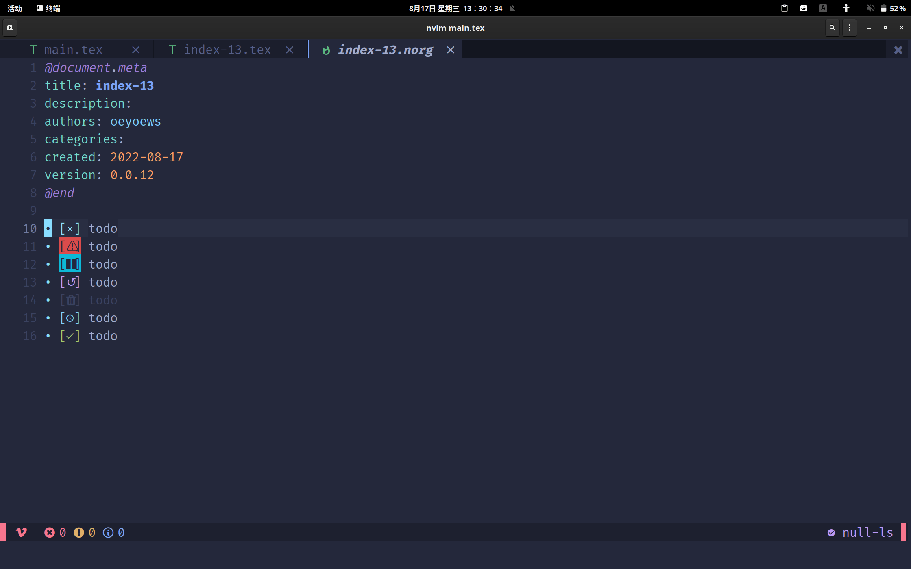
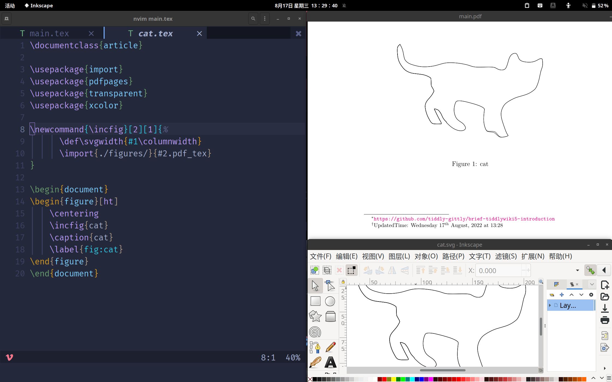
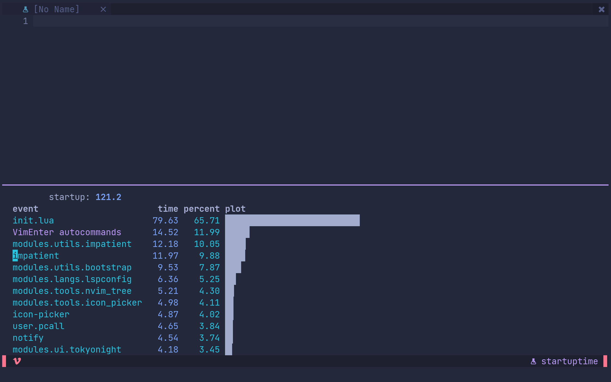
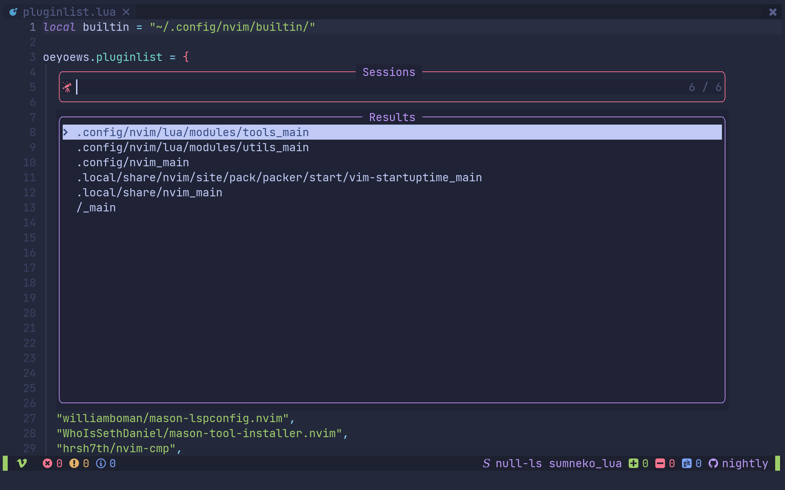
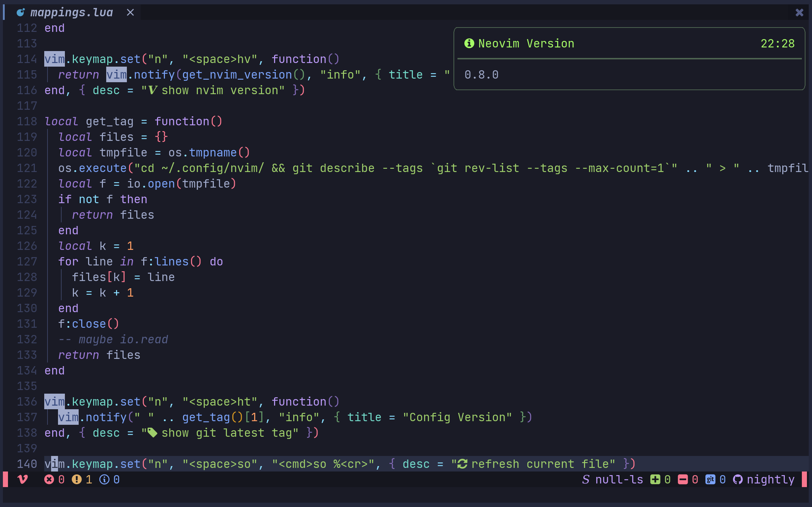

<div align="center">
  <hr>
  <h2>🇳  Neovim</h2>
  <p> 💡 A personal neovim configuration</p>
	🏠 <a href="https://oeyoews.github.io/nvim">Home</a>&nbsp;
  🔗 <a href="">Links </a>&nbsp;
  ⬇️  <a  href="">Download</a>&nbsp;
  🔰 <a  href="">More</a>&nbsp;
  <hr>
</div>

<div align="center">


</div>
<hr>

## 🍾 Screenshots

|  |  |  |
| :----------------------------------------------: | :----------------------------------------------: | ------------------------------------------------ |
|  |  |  |

## 💡 What's that

<!-- A personal neovim configuration -->

<!-- https://readme-typing-svg.herokuapp.com/demo/ -->

<a href="https://git.io/typing-svg"></a>

<h2>  File Struct </h2>

```zsh
📂 ~/.config/nvim/lua
├── 📂 modules
│   ├── 📂langs
│   ├── 📂tools
│   ├── 📂ui
│   └── 📂utils
└── 📂user
```

<h2> ⬇️ Install </h2>

- NOTE: just support nightly
- install pynvim and nightly neovim and clone this repository

### Install neovim nightly

```bash
cd Neovim-nightly-bin && make
```

```bash
# please backup your ~/.config/nvim folder or your nvim configuration firstly
cd ~/.config && git clone --depth 1 https://gitlab.com/oeyoews/nvim.git
```

## 🚀 Features

[Features](doc/features.norg)

## ✅ TODO

[TODO](doc/todo.norg)

## 📖 Wiki(WIP)

- For more details, please read the code or check this [nvim wiki](https://gitlab.com/oeyoews/nvim/-/wikis/home)

## 🔗 Links

- [neovimcraft](https://neovimcraft.com/)
- [news](https://this-week-in-neovim.org/latest)
- [awesome](https://github.com/rockerBOO/awesome-neovim)

## License


