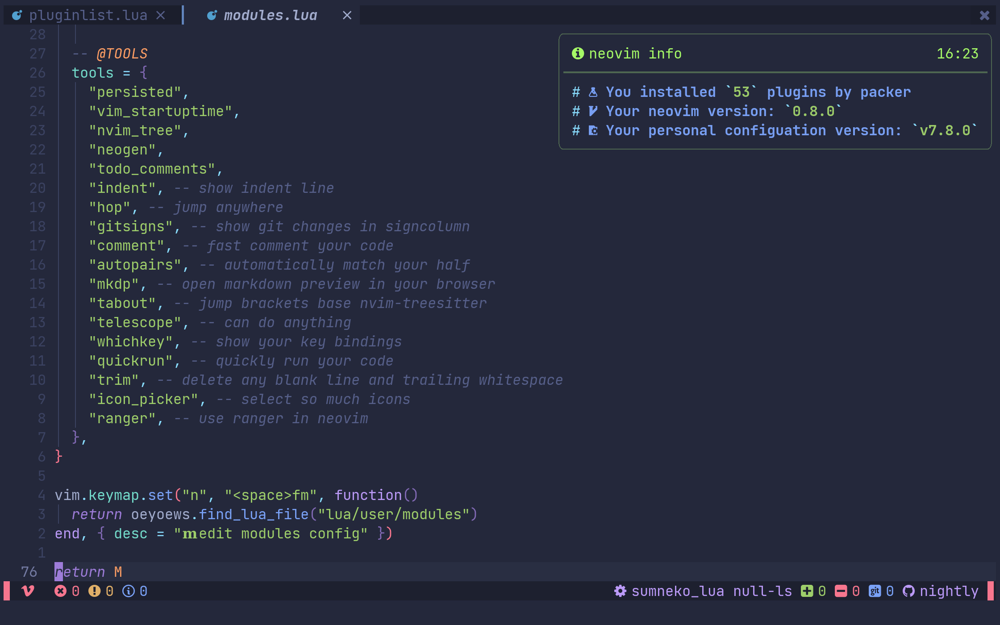
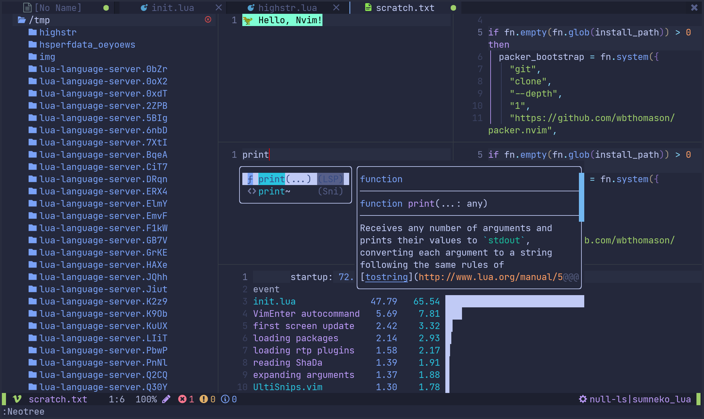
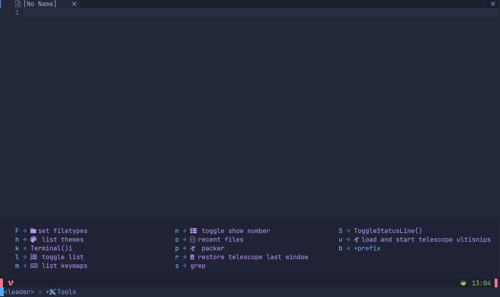
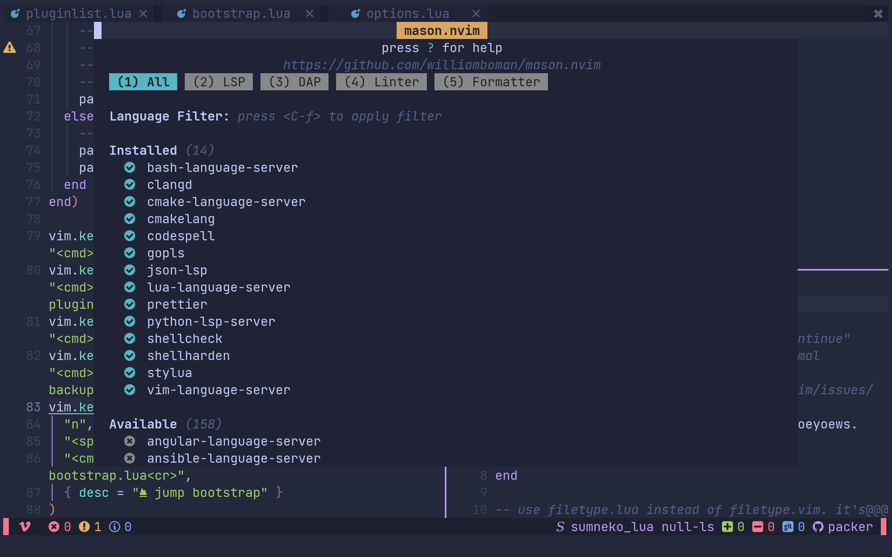
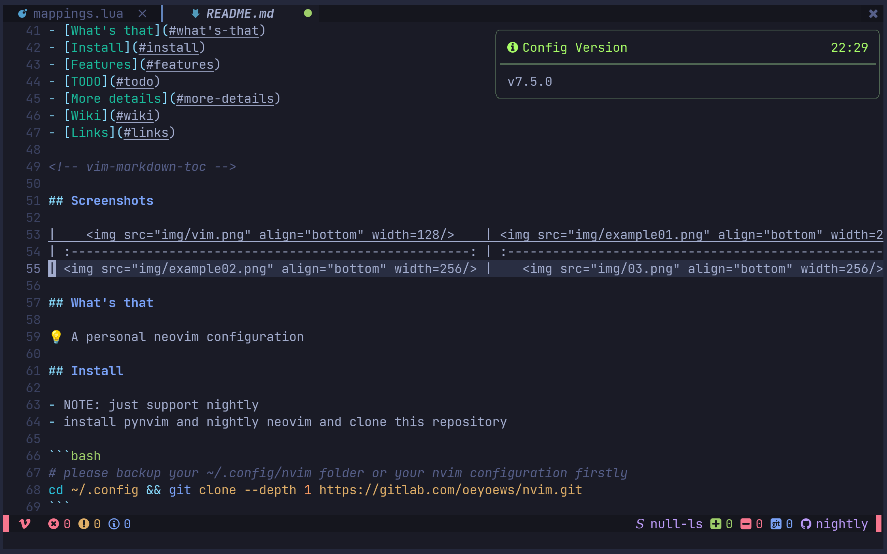
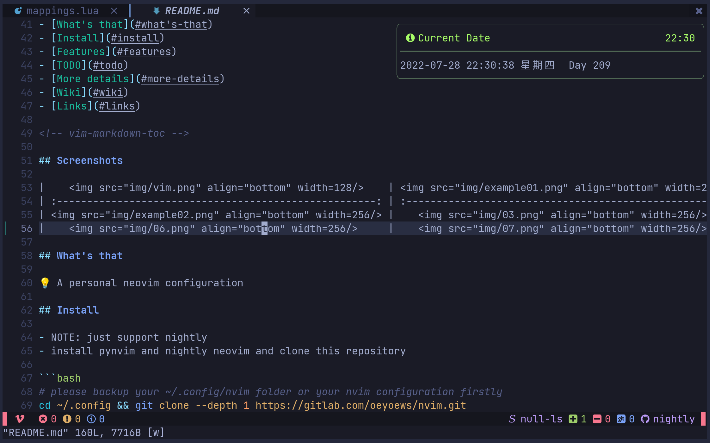

<div align="center">
  <hr>
  <h2>🇳  Neovim</h2>
  <p> 💡 A personal neovim configuration</p>
	🏠 <a href="https://oeyoews.github.io/nvim">Home</a>&nbsp;
  🔗 <a href="">Links </a>&nbsp;
  ⬇️  <a  href="">Download</a>&nbsp;
  🔰 <a  href="">More</a>&nbsp;
  <hr>
</div>

<div align="center">
<!--  -->
<!--  -->
<!--  -->
<!--  -->
<!--  -->


</div>
<hr>

## 🍾 Screenshots

|  |  |  |
| :----------------------------------------------: | :----------------------------------------------: | ------------------------------------------------ |
|  |  |  |
|  |  |  |

## 💡 What's that

<!-- A personal neovim configuration -->

<!-- https://readme-typing-svg.herokuapp.com/demo/ -->

<a href="https://git.io/typing-svg"></a>

<h2> 📂 File Struct </h2>

<details>
<summary>File Tree</summary>

```bash

lua/
├── modules
│   ├── langs
│   │   ├── cmp.lua
│   │   ├── lspconfig.lua
│   │   ├── lspsaga.lua
│   │   ├── mason.lua
│   │   ├── null-ls.lua
│   │   ├── treesitter.lua
│   │   └── trouble.lua
│   ├── tools
│   │   ├── comment.lua
│   │   ├── gitsigns.lua
│   │   ├── header42.lua
│   │   ├── hop.lua
│   │   ├── indent.lua
│   │   ├── nvim_tree.lua
│   │   ├── persistence.lua
│   │   ├── quickrun.lua
│   │   ├── ranger.lua
│   │   ├── startup.lua
│   │   ├── telescope.lua
│   │   ├── trim.lua
│   │   └── whichkey.lua
│   ├── ui
│   │   ├── bufferline.lua
│   │   ├── custom_ui.lua
│   │   ├── fidget.lua
│   │   ├── notify.lua
│   │   ├── tokyonight.lua
│   │   └── web_icons.lua
│   └── utils
│       ├── autocmd.lua
│       ├── bootstrap.lua
│       ├── disable.lua
│       ├── filetype.lua
│       ├── functions.lua
│       ├── mappings.lua
│       ├── oeyoews.lua
│       ├── options.lua
│       ├── pluginlist.lua
│       └── usercmd.lua
└── user
    ├── capabilities.lua
    ├── fun.lua
    ├── lazyload
    │   ├── icon_picker.lua
    │   ├── mkdp.lua
    │   └── neorg.lua
    ├── modules.lua
    └── pcall.lua

7 directories, 43 files
```

</details>

<h2> ⬇️ Install </h2>

- NOTE: just support nightly
- install pynvim and nightly neovim and clone this repository

```bash
# please backup your ~/.config/nvim folder or your nvim configuration firstly
cd ~/.config && git clone --depth 1 https://gitlab.com/oeyoews/nvim.git
```

## 🚀 Features

<details>
<summary>expand</summary>

- switch day-night nvim theme base time automatically
- module manage nvim config, use pure lua
- builtin plugins, like tokynight, notify and some telescope extensions .
- install lsp-servers base your current development automatically
- faster nvim startup, about (60~70) ms
- support markdown-preview and past image in neovim
- support ranger
- hide tilde and show time in statusline
- customize shortkeys
- support codespell
- hide cursorline in insert mode
- customize snippets with ultisnips
- backup plugin snapshot with packer
- etc

</details>

## ✅ TODO

[TODO](docs/todo.norg)

## 📖 Wiki

- For more details, please read the code or check this [nvim wiki](https://gitlab.com/oeyoews/nvim/-/wikis/home)

## 🔗 Links

- [neovim form](https://neovim.discourse.group)
- [emmylua comment](https://emmylua.github.io/zh_CN/annotation.html)
- [neovimcraft](https://neovimcraft.com/)
- [news](https://this-week-in-neovim.org/latest)
